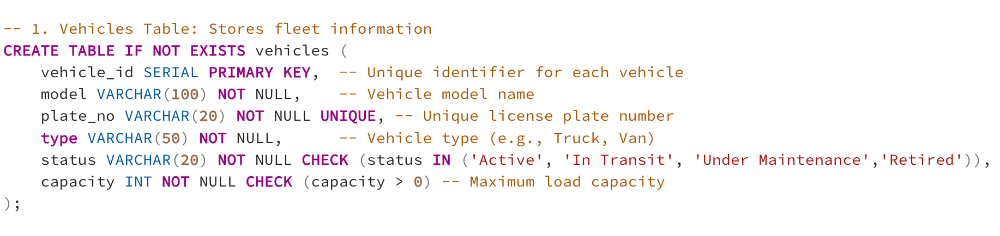
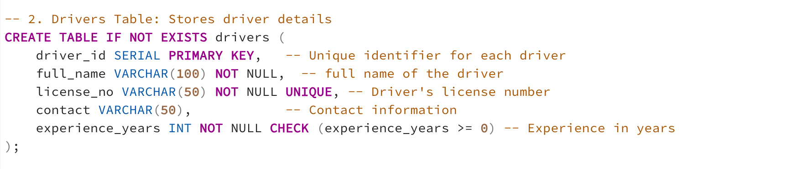
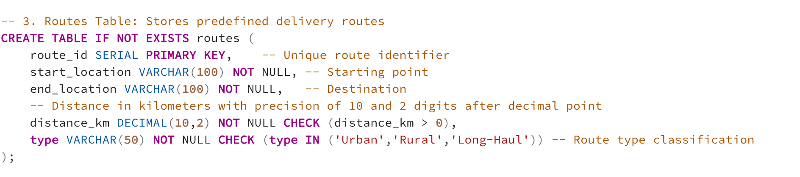
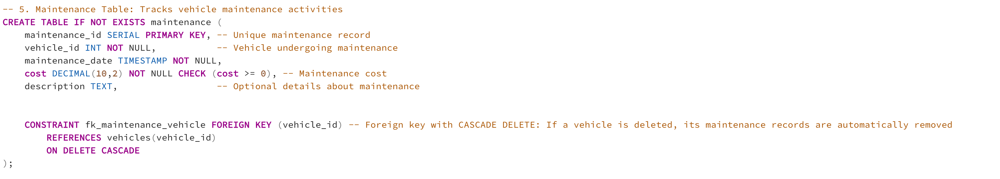
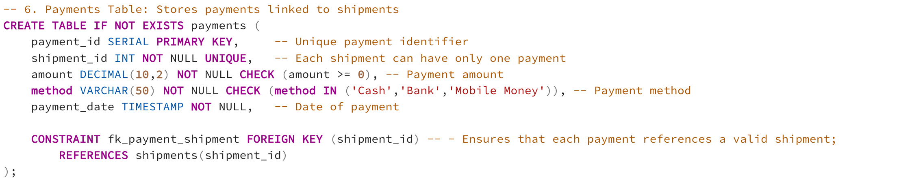
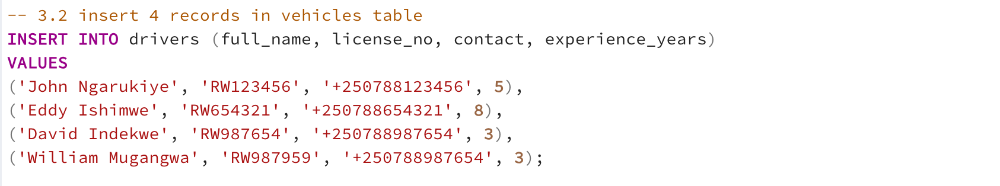
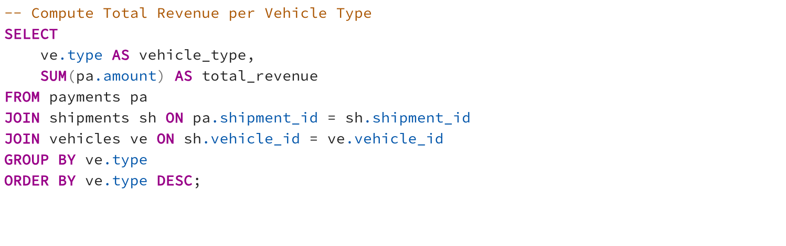

# Logistics Fleet and Maintenance Monitoring System

##  Introduction

The **Logistics Fleet and Maintenance Monitoring System** is designed to efficiently manage a logistics company’s operational data, covering **vehicles**, **drivers**, **routes**, **shipments**, **maintenance**, and **payments**.  
The system ensures smooth coordination across transportation processes — from dispatching shipments to maintaining fleet health and recording payments — while maintaining a consistent and reliable source of truth for operational analytics and decision-making.

### Purpose

The main purpose of this project is to build a **centralized database system** that supports fleet management, shipment tracking, and maintenance oversight. It provides structured and relational data storage for all core logistics activities, ensuring that every vehicle, driver, and shipment can be tracked, audited, and analyzed efficiently.


## System Overview

This system maintains structured data for six key entities:
- **Vehicle** — fleet inventory and capacity management.  
- **Driver** — driver registration, licensing, and experience tracking.  
- **Route** — route definition, distance, and type classification.  
- **Shipment** — movement of goods assigned to vehicles and drivers.  
- **Maintenance** — vehicle servicing records and costs.  
- **Payment** — shipment-specific financial transactions.


## Core Business Operations

### 1. Vehicle Management
Manage fleet records including model, plate number, type, capacity, and operational status. Vehicles are uniquely identified and linked to multiple shipments and maintenance records. Prevents assignment of vehicles under maintenance to new shipments.

### 2. Driver Management
Register and maintain driver details including full name, license number, contact information, and experience. Each driver can handle multiple shipments, ensuring accountability and performance tracking.

### 3. Route Management
Define and manage transportation routes with start and end locations, distances, and types. Routes serve as a key link in shipment planning and route optimization.

### 4. Shipment Management
Coordinate the delivery of goods by linking each shipment to a specific vehicle, driver, and route. Monitors shipment status transitions (Pending → In Transit → Delivered) and enforces that each shipment can have exactly one payment record.

### 5. Maintenance Management
Record maintenance events for vehicles, including service date, cost, and description. Prevents scheduling shipments for vehicles currently under maintenance and supports cost tracking for reporting.

### 6. Payment Management
Record and track payments associated with shipments. Each payment is linked to a single shipment, ensuring financial integrity and preventing duplication. Supports tracking of amount, method, and payment date.

### 7. Reporting and Analytics
Generate summaries and performance reports, including vehicle utilization, driver efficiency, maintenance costs, and payment collections. Provides insights into operational trends for data-driven decision-making.


### Entity Relationship Diagram and Database Relationships Description
!

## Database Relationships

| Relationship | Type | Description |
|---------------|------|--------------|
| Vehicle → Shipment | 1:N | A vehicle can handle multiple shipments |
| Driver → Shipment | 1:N | A driver can handle multiple shipments |
| Route → Shipment | 1:N | A route can serve multiple shipments |
| Vehicle → Maintenance | 1:N | A vehicle can have multiple maintenance records |
| Shipment → Payment | 1:1 | Each shipment is associated with one payment |

## Task 1,2: Create tables with FK and CHECK constraints, Apply CASCADE DELETE for Vehicle → Maintenance.

Below are the **six core tables** along with screenshots of their definitions.


### 1. Vehicle (VehicleID, Model, PlateNo, Type, Status, Capacity)


---

### 2. Driver (DriverID, FullName, LicenseNo, Contact, ExperienceYears)


---

### 3. Route (RouteID, StartLocation, EndLocation, DistanceKM, Type)


---

### 4. Shipment (ShipmentID, VehicleID, DriverID, RouteID, StartDate, EndDate, Status)


---

### 5. Maintenance (MaintenanceID, VehicleID, Date, Cost, Description)


---

### 6. Payment (PaymentID, ShipmentID, Amount, Method, PaymentDate)


## Task 3: Insert at least 5 vehicles and 3 drivers.
### 3.1 Query to insert 5 records in vehicles and db output after insertion


### 3.2 Query to insert 3 records in driver table and db output after insertion



## Task 4:Retrieve total revenue per vehicle type
to come up with the results, firstly, need to insert data into the following tables routes,shipments, and payments. After inser the data into the mentioned table, below is the query screeshot and it results.



## Task 5: Update maintenance cost and observe vehicle downtime.
### 5.1 Let update maintenance cost for a vehicle with id = 2 by 10%
```sql
UPDATE maintenance
SET cost = cost + (cost * 0.1)  -- increase maintenance cost by 10% for a specific vehicle
WHERE vehicle_id = 2;
```

5.1 Compoute vehicles Downtime (number of maintenance days)
```sql
SELECT 
    vehicle_id,
    COUNT(DISTINCT DATE(maintenance_date)) AS downtime_count
FROM maintenance
GROUP BY 1;
```

## Task 6: Identify most efficient driver by completed shipments
Here we are going to compute top driver who have high number of completed shipments
``` sql
SELECT 
    d.driver_id,                     -- Select driver ID
    d.full_name,                     -- Select driver full name
    COUNT(s.shipment_id) AS total_completed_shipments  -- Count number of completed shipments per driver
FROM drivers d
JOIN shipments s 
    ON d.driver_id = s.driver_id     -- Join shipments with drivers to link each shipment to its driver
WHERE s.status = 'Delivered'         -- Only consider shipments that have been completed
GROUP BY d.driver_id, d.full_name    -- Group results by each driver to aggregate shipment counts
ORDER BY total_completed_shipments DESC  -- Sort drivers by total completed shipments (most first)
LIMIT 1;                             -- Return only the top-performing (most efficient) driver
```
Below is the result of the query


## Task 7: Create a view summarizing cost and income balance per vehicle.
A view is needed for this query because it encapsulates complex joins and aggregations into a reusable, consistent, and easy-to-query virtual table for reporting vehicle financial performance
```sql
CREATE OR REPLACE VIEW vehicle_financial_summary AS
SELECT 
    v.vehicle_id,
    v.model,
    v.type,
    -- Sum of maintenance costs per vehicle
	---use COALESCE(..., 0) replaces NULL with 0 so balance calculations work correctly.
	-- use FILTER to exclude vehicles which did'nt undergone any maintainance in the SUM calculation.
    COALESCE(SUM(m.cost) FILTER (WHERE m.vehicle_id IS NOT NULL), 0) AS total_maintenance_cost,
    
    -- Sum of payments received for shipments handled by this vehicle
    COALESCE(SUM(p.amount), 0) AS total_income,
    
    -- Net balance (income minus cost)
    COALESCE(SUM(p.amount), 0) - COALESCE(SUM(DISTINCT m.cost) FILTER (WHERE m.vehicle_id IS NOT NULL), 0) AS net_balance

FROM vehicles v
LEFT JOIN shipments s ON v.vehicle_id = s.vehicle_id
LEFT JOIN payments p ON s.shipment_id = p.shipment_id
LEFT JOIN maintenance m ON v.vehicle_id = m.vehicle_id
GROUP BY 1,2,3;
```

Below is the result of the view


## Task 8: Implement a trigger that marks vehicles unavailable during maintenance
```sql
-- first let create a function that automatically marks a vehicle as Under Maintenance whenever a maintenance record is inserted
-- the create function will be triggered whenever a new insert is made in maintenance table

CREATE OR REPLACE FUNCTION mark_vehicle_under_maintenance()
RETURNS TRIGGER AS $$
BEGIN
    -- Update the status of the vehicle associated with the newly inserted maintenance record
    -- 'NEW.vehicle_id' refers to the vehicle_id of the maintenance record that was just inserted
    UPDATE vehicles
    SET status = 'Under Maintenance'  -- Set the vehicle status to indicate it is unavailable
    WHERE vehicle_id = NEW.vehicle_id; -- Apply the update to the correct vehicle

    -- Return the new maintenance row so the INSERT operation can complete successfully
    RETURN NEW;
END;
$$ LANGUAGE plpgsql;  -- Specify that this is a PL/pgSQL procedural language function
```

```sql
-- Once the procedure is defined, the create a event trigger on maintenance that will invoke the created predecure
 -- The trigger will fires the function after a new row is inserted 
 
CREATE TRIGGER mark_vehicle_unavailable_trg
AFTER INSERT ON maintenance              -- Fires after a new maintenance record is inserted
FOR EACH ROW                             -- Execute once per inserted row
EXECUTE FUNCTION mark_vehicle_under_maintenance();  -- Calls the function to update the vehicle's status

```
