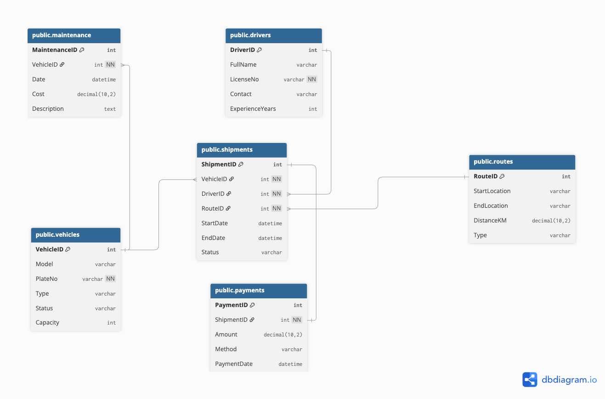
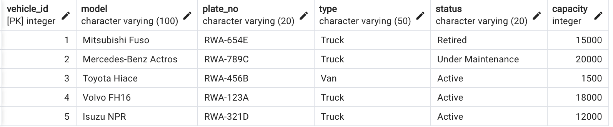
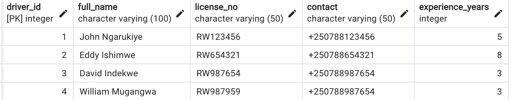
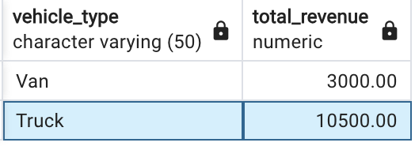
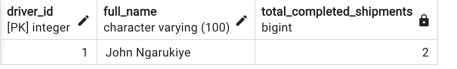
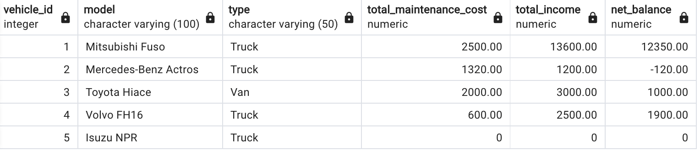

# Logistics Fleet and Maintenance Monitoring System

##  Introduction

The **Logistics Fleet and Maintenance Monitoring System** is designed to efficiently manage a logistics company’s operational data, covering **vehicles**, **drivers**, **routes**, **shipments**, **maintenance**, and **payments**.  
The system ensures smooth coordination across transportation processes — from dispatching shipments to maintaining fleet health and recording payments — while maintaining a consistent and reliable source of truth for operational analytics and decision-making.

### Purpose

The main purpose of this project is to build a **centralized database system** that supports fleet management, shipment tracking, and maintenance oversight. It provides structured and relational data storage for all core logistics activities, ensuring that every vehicle, driver, and shipment can be tracked, audited, and analyzed efficiently.


## System Overview

This system maintains structured data for six key entities:
- **Vehicle** — fleet inventory and capacity management.  
- **Driver** — driver registration, licensing, and experience tracking.  
- **Route** — route definition, distance, and type classification.  
- **Shipment** — movement of goods assigned to vehicles and drivers.  
- **Maintenance** — vehicle servicing records and costs.  
- **Payment** — shipment-specific financial transactions.

## Project Structure

The project follows a clear structure under the **`CAT1`** base folder to organize database scripts and related resources:

```
CAT1/
│
├── logistics_fleet_ddl.sql # Contains the DDL SQL logis
├── logistics_fleet_dml.sql # Contains DML SQL logics 
├── images/ # Folder containing screenshots of sample queries and their results
│ ├──logistic-fleets-ERD.png # ERD diagram for the systen
│ ├── vehicle_insert.png
│ ├── driver_insert.png
│ ├── maintenance_update.png
│ └── .....
```


### Entity Relationship Diagram and Database Relationships Description


## Database Relationships

| Relationship | Type | Description |
|---------------|------|--------------|
| Vehicle → Shipment | 1:N | A vehicle can handle multiple shipments |
| Driver → Shipment | 1:N | A driver can handle multiple shipments |
| Route → Shipment | 1:N | A route can serve multiple shipments |
| Vehicle → Maintenance | 1:N | A vehicle can have multiple maintenance records |
| Shipment → Payment | 1:1 | Each shipment is associated with one payment |

## Task 1,2: Create tables with FK and CHECK constraints, Apply CASCADE DELETE for Vehicle → Maintenance.

Below are the **six core tables** along with screenshots of their definitions.


### 1. Vehicle (VehicleID, Model, PlateNo, Type, Status, Capacity)
```sql
CREATE TABLE IF NOT EXISTS vehicles (
    vehicle_id SERIAL PRIMARY KEY,  -- Unique identifier for each vehicle
    model VARCHAR(100) NOT NULL,    -- Vehicle model name
    plate_no VARCHAR(20) NOT NULL UNIQUE, -- Unique license plate number
    type VARCHAR(50) NOT NULL,      -- Vehicle type (e.g., Truck, Van)
    status VARCHAR(20) NOT NULL CHECK (status IN ('Active', 'In Transit', 'Under Maintenance','Retired')), -- Current status of the vehicle
    capacity INT NOT NULL CHECK (capacity > 0) -- Maximum load capacity
);
```

---

### 2. Driver (DriverID, FullName, LicenseNo, Contact, ExperienceYears)
```sql
CREATE TABLE IF NOT EXISTS drivers (
    driver_id SERIAL PRIMARY KEY,   -- Unique identifier for each driver
    full_name VARCHAR(100) NOT NULL,  -- full name of the driver
    license_no VARCHAR(50) NOT NULL UNIQUE, -- Driver's license number
    contact VARCHAR(50),            -- Contact information
    experience_years INT NOT NULL CHECK (experience_years >= 0) -- Experience in years
);

```

---

### 3. Route (RouteID, StartLocation, EndLocation, DistanceKM, Type)
```sql 
CREATE TABLE IF NOT EXISTS routes (
    route_id SERIAL PRIMARY KEY,    -- Unique route identifier
    start_location VARCHAR(100) NOT NULL, -- Starting point
    end_location VARCHAR(100) NOT NULL,   -- Destination
	-- Distance in kilometers with precision of 10 and 2 digits after decimal point
    distance_km DECIMAL(10,2) NOT NULL CHECK (distance_km > 0), 
    type VARCHAR(50) NOT NULL CHECK (type IN ('Urban','Rural','Long-Haul')) -- Route type classification
);
```

---

### 4. Shipment (ShipmentID, VehicleID, DriverID, RouteID, StartDate, EndDate, Status)
```sql
CREATE TABLE IF NOT EXISTS shipments (
    shipment_id SERIAL PRIMARY KEY,  -- Unique shipment identifier
    vehicle_id INT NOT NULL,         -- Vehicle assigned to shipment
    driver_id INT NOT NULL,          -- Driver assigned
    route_id INT NOT NULL,           -- Route assigned
    start_date TIMESTAMP,            -- Shipment start date
    end_date TIMESTAMP,              -- Shipment end date
    status VARCHAR(20) NOT NULL CHECK (status IN ('Pending','In Transit','Delivered','Cancelled')), -- Current status of shipment

    -- Foreign key constraints
    CONSTRAINT fk_shipment_vehicle FOREIGN KEY (vehicle_id) REFERENCES vehicles(vehicle_id), -- Ensures each shipment is assigned to a valid vehicle; prevents orphan shipments if the vehicle does not exist
    CONSTRAINT fk_shipment_driver FOREIGN KEY (driver_id) REFERENCES drivers(driver_id),  -- Ensures each shipment is assigned to a valid driver; prevents assignment to non-existent drivers
    CONSTRAINT fk_shipment_route FOREIGN KEY (route_id) REFERENCES routes(route_id) -- Ensures each shipment uses a valid route; maintains route integrity
);

```

---

### 5. Maintenance (MaintenanceID, VehicleID, Date, Cost, Description)
```sql
CREATE TABLE IF NOT EXISTS maintenance (
    maintenance_id SERIAL PRIMARY KEY, -- Unique maintenance record
    vehicle_id INT NOT NULL,           -- Vehicle undergoing maintenance
    maintenance_date TIMESTAMP NOT NULL, 
    cost DECIMAL(10,2) NOT NULL CHECK (cost >= 0), -- Maintenance cost
    description TEXT,                  -- Optional details about maintenance

    
    CONSTRAINT fk_maintenance_vehicle FOREIGN KEY (vehicle_id) -- Foreign key with CASCADE DELETE: If a vehicle is deleted, its maintenance records are automatically removed
        REFERENCES vehicles(vehicle_id) 
        ON DELETE CASCADE
); 
```

---

### 6. Payment (PaymentID, ShipmentID, Amount, Method, PaymentDate)
```sql
CREATE TABLE IF NOT EXISTS payments (
    payment_id SERIAL PRIMARY KEY,     -- Unique payment identifier
    shipment_id INT NOT NULL UNIQUE,   -- Each shipment can have only one payment
    amount DECIMAL(10,2) NOT NULL CHECK (amount >= 0), -- Payment amount
    method VARCHAR(50) NOT NULL CHECK (method IN ('Cash','Bank','Mobile Money')), -- Payment method
    payment_date TIMESTAMP NOT NULL,   -- Date of payment

    CONSTRAINT fk_payment_shipment FOREIGN KEY (shipment_id) -- - Ensures that each payment references a valid shipment;
        REFERENCES shipments(shipment_id)
);
```

## Task 3: Insert at least 5 vehicles and 3 drivers.
### 3.1 Query to insert 5 records in vehicles and db output after insertion
```sql
INSERT INTO vehicles (model, plate_no, type, status, capacity)
VALUES
('Mitsubishi Fuso', 'RWA-654E', 'Truck', 'Retired', 15000),
('Mercedes-Benz Actros', 'RWA-789C', 'Truck', 'Under Maintenance', 20000),
('Toyota Hiace', 'RWA-456B', 'Van', 'Active', 1500),
('Volvo FH16', 'RWA-123A', 'Truck', 'Active', 18000),
('Isuzu NPR', 'RWA-321D', 'Truck', 'Active', 12000);
```



### 3.2 Query to insert 3 records in driver table and db output after insertion
```sql 
INSERT INTO drivers (full_name, license_no, contact, experience_years)
VALUES
('John Ngarukiye', 'RW123456', '+250788123456', 5),
('Eddy Ishimwe', 'RW654321', '+250788654321', 8),
('David Indekwe', 'RW987654', '+250788987654', 3),
('William Mugangwa', 'RW987959', '+250788987654', 3);
```


## Task 4:Retrieve total revenue per vehicle type
to come up with the results, firstly, need to insert data into the following tables routes,shipments, and payments. After inser the data into the mentioned table, below is the query screeshot and it results.
```sql
SELECT 
    ve.type AS vehicle_type,
    SUM(pa.amount) AS total_revenue
FROM payments pa
JOIN shipments sh ON pa.shipment_id = sh.shipment_id
JOIN vehicles ve ON sh.vehicle_id = ve.vehicle_id
GROUP BY ve.type
ORDER BY ve.type DESC;
```



## Task 5: Update maintenance cost and observe vehicle downtime.
### 5.1 Let update maintenance cost for a vehicle with id = 2 by 10%
```sql
UPDATE maintenance
SET cost = cost + (cost * 0.1)  -- increase maintenance cost by 10% for a specific vehicle
WHERE vehicle_id = 2;
```

5.1 Compoute vehicles Downtime (number of maintenance days)
```sql
SELECT 
    vehicle_id,
    COUNT(DISTINCT DATE(maintenance_date)) AS downtime_count
FROM maintenance
GROUP BY 1;
```

## Task 6: Identify most efficient driver by completed shipments
Here we are going to compute top driver who have high number of completed shipments
``` sql
SELECT 
    d.driver_id,                     -- Select driver ID
    d.full_name,                     -- Select driver full name
    COUNT(s.shipment_id) AS total_completed_shipments  -- Count number of completed shipments per driver
FROM drivers d
JOIN shipments s 
    ON d.driver_id = s.driver_id     -- Join shipments with drivers to link each shipment to its driver
WHERE s.status = 'Delivered'         -- Only consider shipments that have been completed
GROUP BY d.driver_id, d.full_name    -- Group results by each driver to aggregate shipment counts
ORDER BY total_completed_shipments DESC  -- Sort drivers by total completed shipments (most first)
LIMIT 1;                             -- Return only the top-performing (most efficient) driver
```
Below is the result of the query


## Task 7: Create a view summarizing cost and income balance per vehicle.
A view is needed for this query because it encapsulates complex joins and aggregations into a reusable, consistent, and easy-to-query virtual table for reporting vehicle financial performance
```sql
CREATE OR REPLACE VIEW vehicle_financial_summary AS
SELECT 
    v.vehicle_id,
    v.model,
    v.type,
    -- Sum of maintenance costs per vehicle
	---use COALESCE(..., 0) replaces NULL with 0 so balance calculations work correctly.
	-- use FILTER to exclude vehicles which did'nt undergone any maintainance in the SUM calculation.
    COALESCE(SUM(m.cost) FILTER (WHERE m.vehicle_id IS NOT NULL), 0) AS total_maintenance_cost,
    
    -- Sum of payments received for shipments handled by this vehicle
    COALESCE(SUM(p.amount), 0) AS total_income,
    
    -- Net balance (income minus cost)
    COALESCE(SUM(p.amount), 0) - COALESCE(SUM(DISTINCT m.cost) FILTER (WHERE m.vehicle_id IS NOT NULL), 0) AS net_balance

FROM vehicles v
LEFT JOIN shipments s ON v.vehicle_id = s.vehicle_id
LEFT JOIN payments p ON s.shipment_id = p.shipment_id
LEFT JOIN maintenance m ON v.vehicle_id = m.vehicle_id
GROUP BY 1,2,3;
```

Below is the result of the view


## Task 8: Implement a trigger that marks vehicles unavailable during maintenance
```sql
-- first let create a function that automatically marks a vehicle as Under Maintenance whenever a maintenance record is inserted
-- the create function will be triggered whenever a new insert is made in maintenance table

CREATE OR REPLACE FUNCTION mark_vehicle_under_maintenance()
RETURNS TRIGGER AS $$
BEGIN
    -- Update the status of the vehicle associated with the newly inserted maintenance record
    -- 'NEW.vehicle_id' refers to the vehicle_id of the maintenance record that was just inserted
    UPDATE vehicles
    SET status = 'Under Maintenance'  -- Set the vehicle status to indicate it is unavailable
    WHERE vehicle_id = NEW.vehicle_id; -- Apply the update to the correct vehicle

    -- Return the new maintenance row so the INSERT operation can complete successfully
    RETURN NEW;
END;
$$ LANGUAGE plpgsql;  -- Specify that this is a PL/pgSQL procedural language function
```

```sql
-- Once the procedure is defined, the create a event trigger on maintenance that will invoke the created predecure
 -- The trigger will fires the function after a new row is inserted 
 
CREATE TRIGGER mark_vehicle_unavailable_trg
AFTER INSERT ON maintenance              -- Fires after a new maintenance record is inserted
FOR EACH ROW                             -- Execute once per inserted row
EXECUTE FUNCTION mark_vehicle_under_maintenance();  -- Calls the function to update the vehicle's status

```
